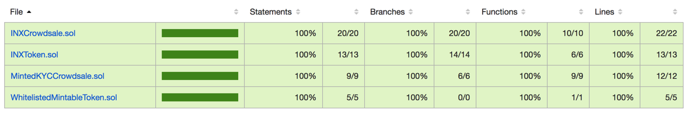

# INX-TOKEN-SALE

### INX Token Smart Contract

* Is ERC20 compliant
* Responsible for holding all tokens balances on the INX platform

* The **token** has the following properties
  * Defines a token `name` - `INX Token`
  * Defines a token `symbol` - `INX`
  * Defines the number of `decimals` the token is divisible by - `18`
  * Defines the total supply of tokens - tokens are minted when contributions are made or via Investx whitelisted accredited accounts

* The token has a `transfersEnabled` flag that can be called once and once only to enable transfers for all (intended to be used on token sale completion)
* Defines the `investxPlatform` address which will represent the account where INX token will be sent to invest in SME businesses.
* Includes a Investx `founders` list with a locked until date that restricts transfers until Sunday, February 28, 2021 11:59:59 PM. Within this period tokens can be transfered to the `investxPlatform` platform to invest in SME businesses. 

### INX Crowdsale Smart Contract

* Responsible for managing ICO token sales

* The **crowdsale** has the following properties
  * Ability to specify **min** contributions per address
  * Ability to define a **open and close date** for the full ICO - tokens cannot be bought until the ICO opens (or after close)
  * Ability to transfer ETH **immeadiately** 
  * Ability to define **whitelisted** address for people who are permitted to participate in the crowdsale
    * If not whitelisted the transaction is rejected
    * A third party solution for performing KYC/AML is required, the contract simply stores a map of approved addresses
  * The crowdsale is **pausable** which can stop any more contributors from participating in case of error, fault etc

### Deployment Order

_see `migrations` folder for a more details_

* Deploy `INXToken`

* Deploy `INXCrowdsale`
  * Whitelist the crowdsale account so they can receive tokens e.g. `token.addAddressToWhitelist(INXCrowdsale.address)`
 

## Installation

1. Install [Truffle](http://truffleframework.com) and [NodeJs](https://nodejs.org/en/) (version 8 upwards)
```bash
npm install -g truffle
```
	
2. Install dependencies.
```bash
npm install
```

3. Run tests. *Tests start their own instance of `ganache-cli`*
```bash
npm run test
```

### Code Coverage

* Code coverage and instrumentation performed by [solidity-coverage](https://github.com/sc-forks/solidity-coverage)

* To run code coverage `npm run coverage` - this will produce the following:
  * Configuration found in `./solcover.js`
  * HTML output in `/coverage/index.html`
  * JSON output in `./.coverage.json`
  * Terminal output
  
#### Code Coverage Snapshot

  
 
### Code Linting
 
* Linting performed by [Solium](https://www.npmjs.com/package/solium)

1. Install once with
```bash
npm install -g solium
```

2. Run linter
```bash
npm run lint
```
 


